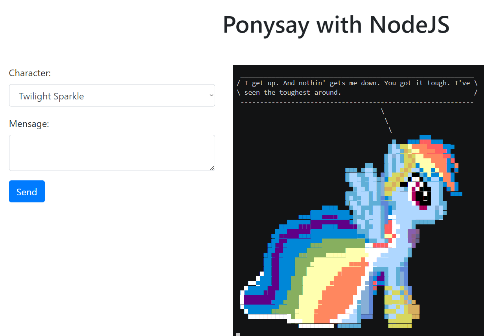

# Ponysay with NodeJS

## Instructions

This project is a web application that uses Node.js to display text messages with Ponysay characters using Asciinema.

## Prerequisites

Before running this project, make sure you have installed:

- Node.js
- Asciinema
- ponysay
- Texinfo

You can find installation instructions for each of these packages in the "Installation of Prerequisites" section below.

## Installation of Prerequisites

### Texinfo

``sudo apt-get install texinfo``

### ponysay
Make sure Python is installed, as Ponisey is written in this programming language. 

``git clone https://github.com/erkin/ponysay.git`` 

``cd ponysay`` 

``./setup.py --freedom=partial install``

### Asciinema 

``sudo apt-add-repository ppa:zanchey/asciinema`` 

``sudo apt-get update`` 

``sudo apt-get install asciinema``

## Running the project without Docker

1. Clone this repository: 

``git clone https://github.com/efrj/ponysay-with-nodejs`` 

2. Enter the project folder: 

``ponysay-with-nodejs`` 

3. Install Node.js dependencies: 

``npm install``

4. Launch the application: 

``node app.js``

The application will be available at http://localhost:3000.

## Running the project with Docker 

### Note: 

The application is still not working properly in a Docker environment because of Asciinema. Tests are being carried out with other solutions to show the prints displayed by Ponysay. 

1. Install Docker and Docker Compose on your system.
2. Clone this repository:
``https://github.com/efrj/ponysay-with-nodejs``

3. Enter the project folder:
``cd ponysay-with-nodejs``

4. Build the Docker image:
``docker-compose build``

5. Launch the application using Docker Compose:
``docker-compose up``

The application will be available at http://localhost:3000.

### Contributing
If you want to contribute to this project, please submit a pull request to the original repository. All contributions are welcome!

## License 
This project is licensed under the MIT license. See the LICENSE file for more information.

## Instruções em Português

Este projeto é uma aplicação web que usa o Node.js para exibir mensagens de texto com personagens do Ponysay usando o Asciinema.

## Pré-requisitos

Antes de executar este projeto, certifique-se de ter instalado:

- Node.js
- Asciinema
- Ponysay
- Texinfo

Você pode encontrar instruções de instalação para cada um desses pacotes na seção "Instalação de Pré-requisitos" abaixo.

## Instalação de Pré-requisitos

### Texinfo

``sudo apt-get install texinfo`` 

### Ponysay
Certifique-se de que o Python está instalado, pois o Ponisey é escrito nesta linguagem de programação. 
``git clone https://github.com/erkin/ponysay.git`` 
``cd ponysay`` 
``./setup.py --freedom=partial install`` 

### Asciinema 
``sudo apt-add-repository ppa:zanchey/asciinema`` 
``sudo apt-get update`` 
``sudo apt-get install asciinema`` 

## Executando o projeto sem Docker

1. Clone este repositório: 
``git clone https://github.com/efrj/ponysay-with-nodejs`` 

2. Entre na pasta do projeto: 
``ponysay-with-nodejs`` 

3. Instale as dependências do Node.js: 
``npm install`` 

4. Inicie a aplicação: 
``node app.js`` 

A aplicação estará disponível no endereço http://localhost:3000. 

## Executando o projeto com Docker 

### Observação: 

A aplicação ainda não está funcionando corretamente em ambiente Docker por causa do Asciinema. Estão sendo realizados testes com outras soluções para mostrar as gravuras exibidas pelo Ponysay. 

1. Instale o Docker e o Docker Compose em seu sistema. 
2. Clone este repositório: 
``https://github.com/efrj/ponysay-with-nodejs``

3. Entre na pasta do projeto: 
``cd ponysay-with-nodejs`` 

4. Construa a imagem do Docker: 
``docker-compose build`` 

5. Inicie a aplicação usando o Docker Compose: 
``docker-compose up`` 

A aplicação estará disponível no endereço http://localhost:3000. 

### Contribuindo 
Se você deseja contribuir com este projeto, envie uma solicitação de pull para o repositório original. Todas as contribuições são bem-vindas!

## Licença 
Este projeto está licenciado sob a licença MIT. Consulte o arquivo LICENSE para obter mais informações.
